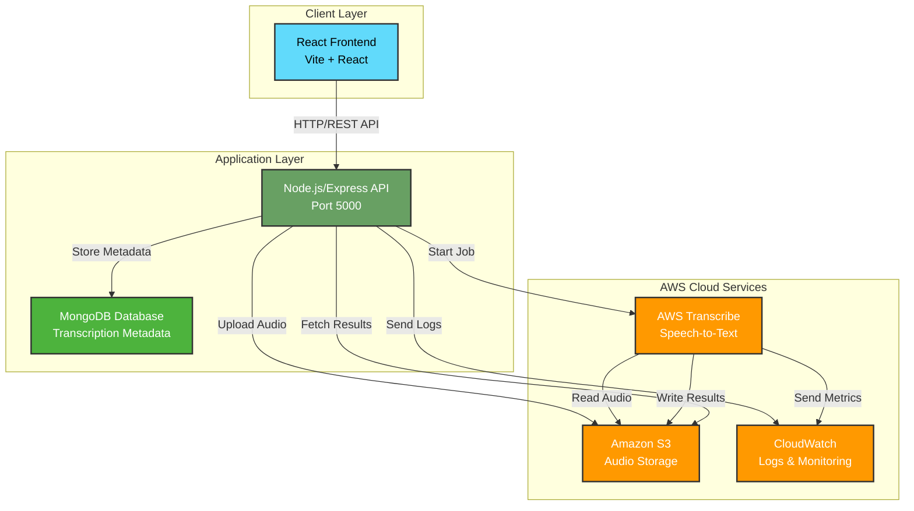
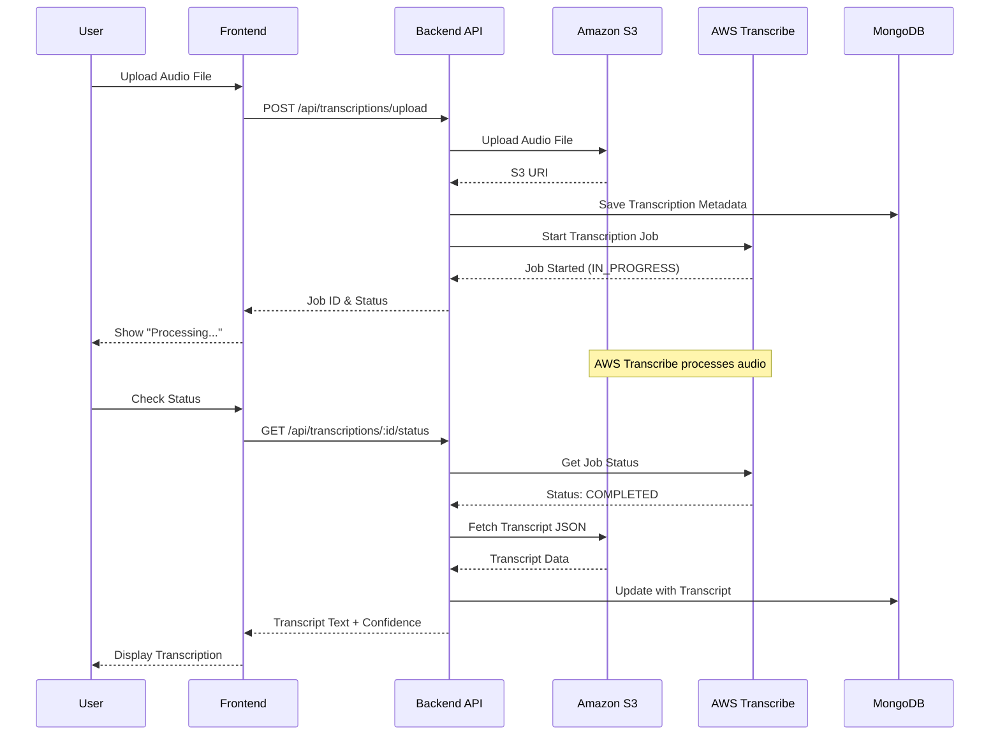
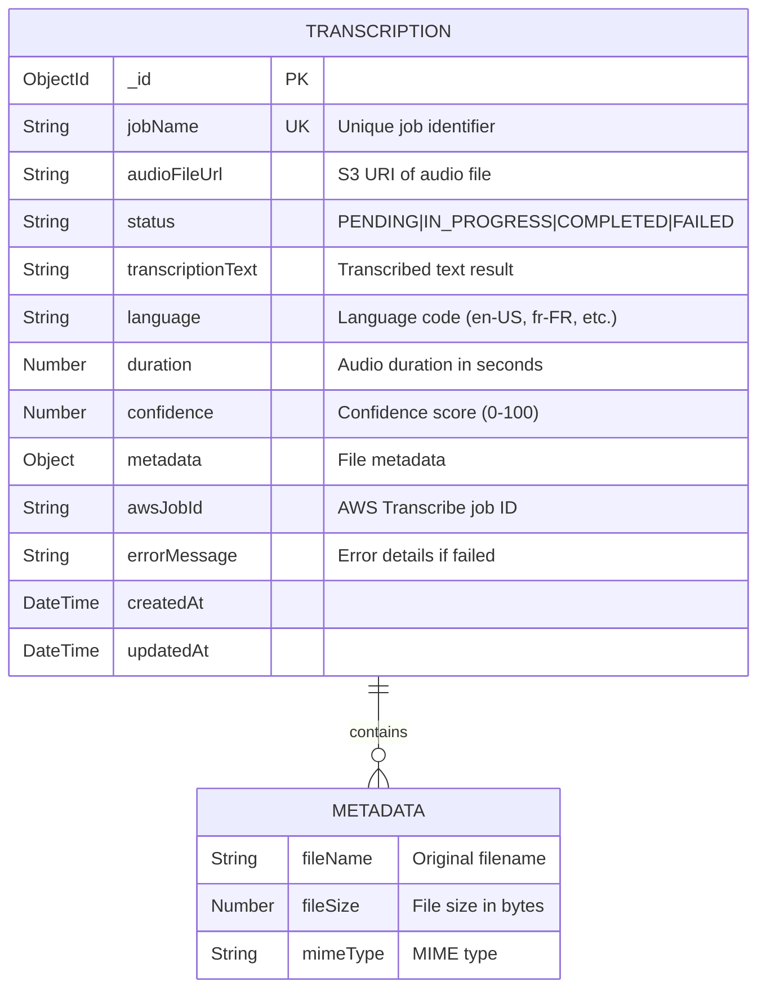
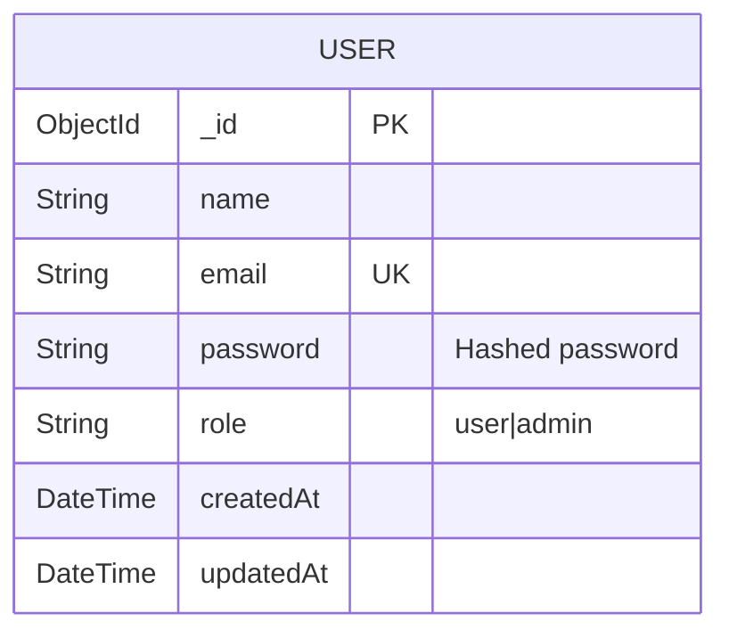
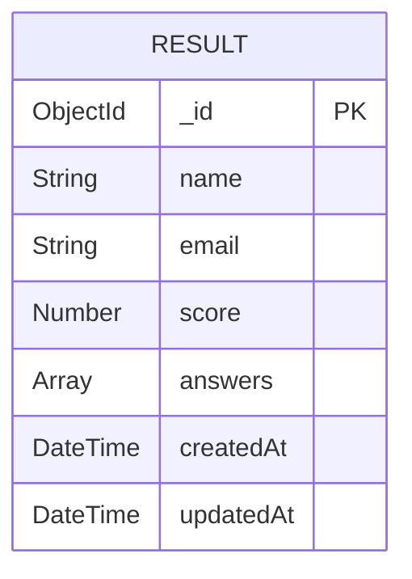
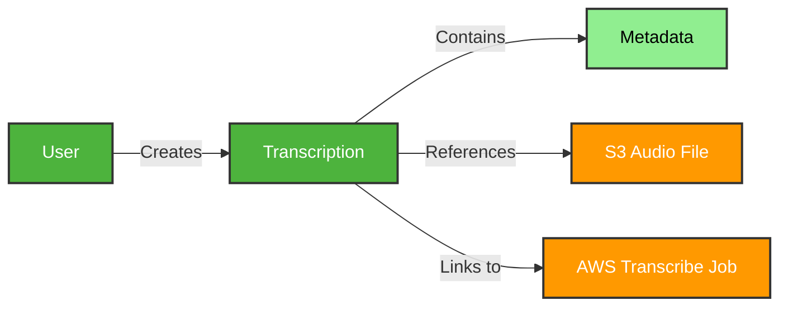
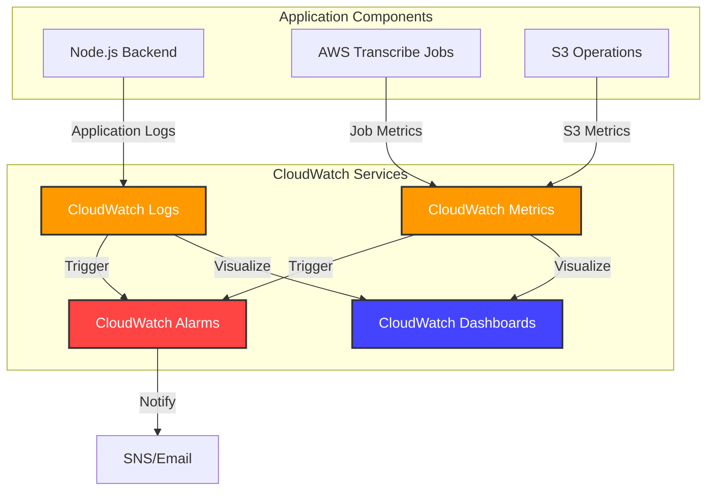
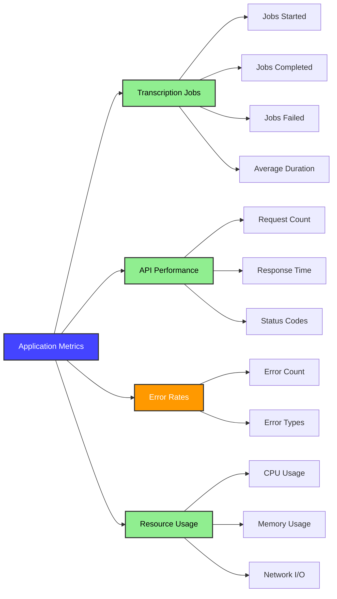

# 🎙️ Transcription AI Project

Une application complète de transcription vocale utilisant **AWS Transcribe**, **React**, **Node.js/Express** et **MongoDB**.

## 📋 Vue d'ensemble

Ce projet permet aux utilisateurs d'enregistrer ou de télécharger des fichiers audio pour obtenir une transcription textuelle précise grâce à l'intelligence artificielle d'Amazon Web Services (AWS).

---

## 🏗️ Architecture du Système

### Architecture Globale



### Flux de Transcription



---

## 📊 Schéma de Base de Données

### MongoDB Collections

#### Collection: `transcriptions`



#### Collection: `users`



#### Collection: `results`



### Schéma des Relations



---

## 📡 API Endpoints

### Transcription Endpoints

| Method | Endpoint | Description |
|--------|----------|-------------|
| `POST` | `/api/transcriptions/upload` | Upload audio and start transcription |
| `GET` | `/api/transcriptions/:id/status` | Check transcription status |
| `GET` | `/api/transcriptions` | Get all transcriptions (paginated) |
| `DELETE` | `/api/transcriptions/:id` | Delete a transcription |

### Authentication Endpoints

| Method | Endpoint | Description |
|--------|----------|-------------|
| `POST` | `/api/auth/register` | Register new user |
| `POST` | `/api/auth/login` | User login |

### Health Check

| Method | Endpoint | Description |
|--------|----------|-------------|
| `GET` | `/health` | Server health status |

---

## ☁️ AWS Services Configuration

### Amazon S3

**Purpose**: Stockage sécurisé des fichiers audio et des résultats de transcription

**Configuration**:
- **Bucket Name**: Défini dans `S3_BUCKET` (doit être unique globalement)
- **Region**: `eu-west-1` (ou votre région préférée)
- **Structure des fichiers**:
  ```
  s3://your-bucket-name/
  ├── audio/
  │   ├── uuid-1.mp3
  │   ├── uuid-2.wav
  │   └── uuid-3.m4a
  └── transcripts/
      ├── job-1.json
      └── job-2.json
  ```

**Permissions IAM requises**:
```json
{
  "Version": "2012-10-17",
  "Statement": [
    {
      "Effect": "Allow",
      "Action": [
        "s3:PutObject",
        "s3:GetObject",
        "s3:DeleteObject",
        "s3:ListBucket"
      ],
      "Resource": [
        "arn:aws:s3:::your-bucket-name/*",
        "arn:aws:s3:::your-bucket-name"
      ]
    }
  ]
}
```

### AWS Transcribe

**Purpose**: Conversion automatique de la parole en texte

**Fonctionnalités activées**:
- **Speaker Labels**: Identification des locuteurs (jusqu'à 5)
- **Language Detection**: Support multi-langues (en-US, fr-FR, es-ES, etc.)
- **Confidence Scores**: Score de confiance pour chaque mot

**Permissions IAM requises**:
```json
{
  "Version": "2012-10-17",
  "Statement": [
    {
      "Effect": "Allow",
      "Action": [
        "transcribe:StartTranscriptionJob",
        "transcribe:GetTranscriptionJob",
        "transcribe:ListTranscriptionJobs",
        "transcribe:DeleteTranscriptionJob"
      ],
      "Resource": "*"
    }
  ]
}
```

---

## 📊 CloudWatch Monitoring

### Vue d'ensemble

AWS CloudWatch est utilisé pour surveiller les performances, les logs et les métriques de l'application.



### Configuration CloudWatch Logs

#### 1. Installation du CloudWatch Agent (Backend)

```bash
npm install aws-cloudwatch-log
```

#### 2. Configuration dans le Backend

Créez un fichier `src/services/cloudwatch.service.js`:

```javascript
const { CloudWatchLogsClient, PutLogEventsCommand, CreateLogStreamCommand } = require('@aws-sdk/client-cloudwatch-logs');

class CloudWatchService {
  constructor() {
    this.client = new CloudWatchLogsClient({
      region: process.env.AWS_REGION
    });
    this.logGroupName = '/aws/transcription-app/backend';
    this.logStreamName = `${process.env.NODE_ENV}-${Date.now()}`;
  }

  async log(level, message, metadata = {}) {
    const logEvent = {
      message: JSON.stringify({
        level,
        message,
        metadata,
        timestamp: new Date().toISOString()
      }),
      timestamp: Date.now()
    };

    const command = new PutLogEventsCommand({
      logGroupName: this.logGroupName,
      logStreamName: this.logStreamName,
      logEvents: [logEvent]
    });

    await this.client.send(command);
  }
}

module.exports = new CloudWatchService();
```

#### 3. Groupes de Logs Recommandés

| Log Group | Description |
|-----------|-------------|
| `/aws/transcription-app/backend` | Logs de l'application backend |
| `/aws/transcription-app/api-requests` | Logs des requêtes API |
| `/aws/transcription-app/errors` | Logs d'erreurs uniquement |
| `/aws/transcribe/jobs` | Logs des jobs de transcription |

### Métriques CloudWatch

#### Métriques Personnalisées à Surveiller



#### Métriques Clés

| Métrique | Description | Seuil d'Alerte |
|----------|-------------|----------------|
| `TranscriptionJobsStarted` | Nombre de jobs démarrés | - |
| `TranscriptionJobsCompleted` | Nombre de jobs terminés avec succès | - |
| `TranscriptionJobsFailed` | Nombre de jobs échoués | > 5 en 5 min |
| `APIResponseTime` | Temps de réponse moyen de l'API | > 2000ms |
| `ErrorRate` | Taux d'erreurs (%) | > 5% |
| `S3UploadDuration` | Durée moyenne d'upload S3 | > 5000ms |
| `DatabaseQueryTime` | Temps de requête MongoDB | > 1000ms |

### Configuration des Alarmes

#### Exemple: Alarme pour Jobs Échoués

```bash
aws cloudwatch put-metric-alarm \
  --alarm-name transcription-jobs-failed-high \
  --alarm-description "Alert when transcription jobs fail frequently" \
  --metric-name TranscriptionJobsFailed \
  --namespace TranscriptionApp \
  --statistic Sum \
  --period 300 \
  --threshold 5 \
  --comparison-operator GreaterThanThreshold \
  --evaluation-periods 1 \
  --alarm-actions arn:aws:sns:eu-west-1:ACCOUNT_ID:transcription-alerts
```

#### Exemple: Alarme pour Temps de Réponse API

```bash
aws cloudwatch put-metric-alarm \
  --alarm-name api-response-time-high \
  --alarm-description "Alert when API response time is too high" \
  --metric-name APIResponseTime \
  --namespace TranscriptionApp \
  --statistic Average \
  --period 60 \
  --threshold 2000 \
  --comparison-operator GreaterThanThreshold \
  --evaluation-periods 2 \
  --alarm-actions arn:aws:sns:eu-west-1:ACCOUNT_ID:transcription-alerts
```

### Dashboard CloudWatch

#### Création d'un Dashboard

```bash
aws cloudwatch put-dashboard \
  --dashboard-name TranscriptionAppDashboard \
  --dashboard-body file://cloudwatch-dashboard.json
```

#### Exemple de Configuration Dashboard (`cloudwatch-dashboard.json`)

```json
{
  "widgets": [
    {
      "type": "metric",
      "properties": {
        "metrics": [
          ["TranscriptionApp", "TranscriptionJobsStarted"],
          [".", "TranscriptionJobsCompleted"],
          [".", "TranscriptionJobsFailed"]
        ],
        "period": 300,
        "stat": "Sum",
        "region": "eu-west-1",
        "title": "Transcription Jobs Overview"
      }
    },
    {
      "type": "metric",
      "properties": {
        "metrics": [
          ["TranscriptionApp", "APIResponseTime"]
        ],
        "period": 60,
        "stat": "Average",
        "region": "eu-west-1",
        "title": "API Response Time"
      }
    },
    {
      "type": "log",
      "properties": {
        "query": "SOURCE '/aws/transcription-app/errors' | fields @timestamp, @message | sort @timestamp desc | limit 20",
        "region": "eu-west-1",
        "title": "Recent Errors"
      }
    }
  ]
}
```

### Logs Insights - Requêtes Utiles

#### 1. Erreurs des dernières 24h

```sql
fields @timestamp, @message, level, metadata.error
| filter level = "error"
| sort @timestamp desc
| limit 100
```

#### 2. Temps de réponse moyen par endpoint

```sql
fields @timestamp, metadata.endpoint, metadata.duration
| stats avg(metadata.duration) as avg_duration by metadata.endpoint
| sort avg_duration desc
```

#### 3. Jobs de transcription échoués

```sql
fields @timestamp, @message, metadata.jobName, metadata.errorMessage
| filter metadata.status = "FAILED"
| sort @timestamp desc
```

#### 4. Analyse des performances S3

```sql
fields @timestamp, metadata.operation, metadata.duration, metadata.fileSize
| filter metadata.service = "S3"
| stats avg(metadata.duration) as avg_duration, max(metadata.duration) as max_duration by metadata.operation
```

### Notifications SNS

#### Configuration des Notifications Email

```bash
# Créer un topic SNS
aws sns create-topic --name transcription-alerts

# S'abonner par email
aws sns subscribe \
  --topic-arn arn:aws:sns:eu-west-1:ACCOUNT_ID:transcription-alerts \
  --protocol email \
  --notification-endpoint your-email@example.com
```

---

## 🚀 Prérequis

Avant de commencer, assurez-vous d'avoir installé :

*   [Node.js](https://nodejs.org/) (v16 ou supérieur)
*   [MongoDB](https://www.mongodb.com/try/download/community) (local ou Atlas)
*   Un compte **AWS** actif avec des clés d'accès (Access Key ID & Secret Access Key)
*   **AWS CLI** configuré (pour CloudWatch et monitoring)

---

## 🛠️ Installation et Configuration

### 1. Cloner le projet

```bash
git clone <votre-repo-url>
cd transcription-ai-project
```

### 2. Configuration du Backend

Allez dans le dossier `backend` et installez les dépendances :

```bash
cd backend
npm install
```

Créez un fichier `.env` à la racine du dossier `backend` avec les informations suivantes :

```env
# Serveur
PORT=5000
NODE_ENV=development

# Base de données
MONGODB_URI=mongodb://localhost:27017/transcription-db

# AWS Configuration
AWS_REGION=eu-west-1              # Votre région AWS (ex: eu-west-1 pour Paris/Irlande)
AWS_ACCESS_KEY_ID=VOTRE_ACCESS_KEY
AWS_SECRET_ACCESS_KEY=VOTRE_SECRET_KEY
S3_BUCKET=nom-de-votre-bucket-unique

# CloudWatch (Optionnel)
CLOUDWATCH_LOG_GROUP=/aws/transcription-app/backend
CLOUDWATCH_ENABLED=true
```

> **Note** : Assurez-vous que votre utilisateur IAM AWS a les droits suivants:
> - `AmazonS3FullAccess`
> - `AmazonTranscribeFullAccess`
> - `CloudWatchLogsFullAccess`
> - `CloudWatchFullAccess`

### 3. Configuration du Frontend

Allez dans le dossier `linguistai-frontend` et installez les dépendances :

```bash
cd ../linguistai-frontend
npm install
```

### 4. Configuration AWS CloudWatch

```bash
# Créer les groupes de logs
aws logs create-log-group --log-group-name /aws/transcription-app/backend
aws logs create-log-group --log-group-name /aws/transcription-app/errors
aws logs create-log-group --log-group-name /aws/transcription-app/api-requests

# Définir la rétention (30 jours)
aws logs put-retention-policy \
  --log-group-name /aws/transcription-app/backend \
  --retention-in-days 30
```

---

## ▶️ Démarrage de l'application

### Démarrer le Backend

Dans le dossier `backend` :

```bash
npm run dev
```
Le serveur démarrera sur `http://localhost:5000`.

### Démarrer le Frontend

Dans le dossier `linguistai-frontend` :

```bash
npm run dev
```
L'application sera accessible sur `http://localhost:5173`.

---

## 🧪 Utilisation et Test

### Test de la Transcription (AWS Transcribe)

Vous pouvez tester la fonctionnalité de transcription directement via l'interface utilisateur ou en utilisant les scripts fournis dans le backend.

#### Via le script de test (Backend)

Un script `test_transcription.sh` est disponible pour vérifier rapidement votre configuration AWS.

```bash
cd backend
chmod +x test_transcription.sh
./test_transcription.sh /chemin/vers/votre/fichier_audio.mp3
```

Ce script va :
1. Uploader le fichier sur S3.
2. Lancer un job de transcription AWS.
3. Attendre et afficher le résultat de la transcription.

#### Via l'Application (Frontend)

1. Ouvrez l'application dans votre navigateur.
2. Utilisez le composant d'upload ou d'enregistrement vocal.
3. Le fichier sera envoyé au backend, puis à AWS S3.
4. Une fois la transcription terminée par AWS, le texte s'affichera à l'écran.

---

## 📂 Structure du Projet

```
transcription-ai-project/
├── backend/                 # Serveur Node.js/Express
│   ├── src/
│   │   ├── controllers/     # Logique métier
│   │   │   ├── transcription.controller.js
│   │   │   ├── auth.controller.js
│   │   │   └── result.controller.js
│   │   ├── models/          # Modèles Mongoose
│   │   │   ├── Transcription.js
│   │   │   ├── User.js
│   │   │   └── Result.js
│   │   ├── routes/          # Définitions des routes API
│   │   │   ├── transcription.routes.js
│   │   │   ├── auth.routes.js
│   │   │   └── result.routes.js
│   │   ├── services/        # Services AWS (S3, Transcribe, CloudWatch)
│   │   │   ├── s3.service.js
│   │   │   ├── transcribe.service.js
│   │   │   └── cloudwatch.service.js
│   │   ├── middleware/      # Middleware Express
│   │   │   └── auth.middleware.js
│   │   └── server.js        # Point d'entrée
│   ├── .env                 # Variables d'environnement
│   └── package.json
├── linguistai-frontend/     # Application React
│   ├── src/
│   │   ├── components/      # Composants UI
│   │   ├── hooks/           # Hooks personnalisés
│   │   ├── services/        # Services API
│   │   └── App.jsx
│   └── package.json
├── infrastructure/          # Infrastructure as Code
│   ├── cloudformation.yml   # Template CloudFormation
│   └── scripts/
└── README.md                # Documentation du projet
```

---

## 📈 Monitoring et Maintenance

### Vérification de la Santé du Système

```bash
# Health check de l'API
curl http://localhost:5000/health

# Vérifier les logs CloudWatch
aws logs tail /aws/transcription-app/backend --follow

# Vérifier les métriques
aws cloudwatch get-metric-statistics \
  --namespace TranscriptionApp \
  --metric-name TranscriptionJobsCompleted \
  --start-time 2024-01-01T00:00:00Z \
  --end-time 2024-01-02T00:00:00Z \
  --period 3600 \
  --statistics Sum
```

### Métriques à Surveiller Quotidiennement

- ✅ Taux de réussite des transcriptions (> 95%)
- ✅ Temps de réponse API (< 2s)
- ✅ Taux d'erreurs (< 1%)
- ✅ Utilisation du bucket S3
- ✅ Coûts AWS

---


## 🔧 Dépannage

### Problèmes Courants

#### 1. Erreur de connexion MongoDB
```bash
# Vérifier que MongoDB est démarré
sudo systemctl status mongod

# Démarrer MongoDB
sudo systemctl start mongod
```

#### 2. Erreur AWS Credentials
```bash
# Vérifier la configuration AWS
aws configure list

# Tester les credentials
aws sts get-caller-identity
```

#### 3. Jobs de transcription bloqués
```bash
# Vérifier les logs CloudWatch
aws logs tail /aws/transcribe/jobs --follow

# Lister les jobs en cours
aws transcribe list-transcription-jobs --status IN_PROGRESS
```

---

## 📄 Licence

Ce projet est sous licence MIT.

---

## 🤝 Contribution

Les contributions sont les bienvenues ! N'hésitez pas à ouvrir une issue ou une pull request.

---

## 📞 Support

Pour toute question ou problème, veuillez ouvrir une issue sur GitHub ou contacter l'équipe de développement.
